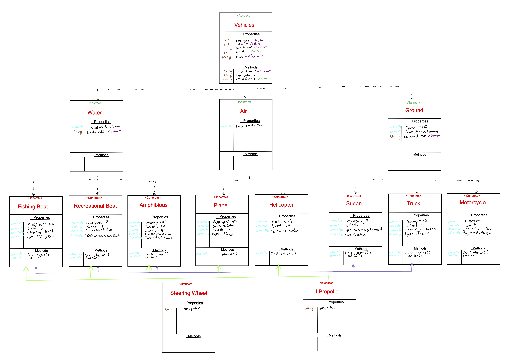

# Dot Net Motors

------------------------------

# OOP Principles
#### Labs 5 & 6 
##### *Author: Mike Kelly*

------------------------------

## Description
This C# program shows the four prinicples of Object Orientated Programming.  It includes Inheritance, Polymorphism, Abstraction, and Encapsulation.

------------------------------

## Getting Started
Clone this repository to your local machine.
```
$ git clone [https://github.com/Michael-S-Kelly/DotNetMotors.git]
```
#### To run the program from Visual Studio:
Select ```File``` -> ```Open``` -> ```Project/Solution```

Next navigate to the location you cloned the Repository.

Double click on the ```DotNetMotors``` directory.

Then select and open ```DotNetMotors.sln```

------------------------------

## Visuals


##### Classes Diagram



------------------------------

## Change Log


------------------------------
## Collaborators, Contributors, and Other Resources used

### Collaborators

### Contributors


### Other Resources

------------------------------
For more information on Markdown: https://www.markdownguide.org/cheat-sheet