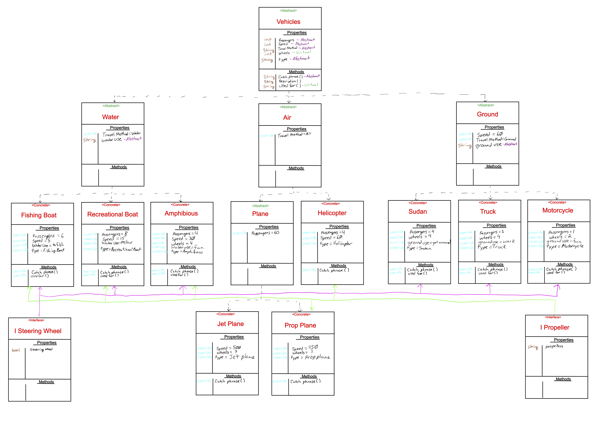

# Dot Net Motors

------------------------------

# OOP Principles
#### Labs 5 & 6 
##### *Author: Mike Kelly*

------------------------------

## Description
This C# program shows the four prinicples of Object Orientated Programming.  It includes Inheritance, Polymorphism, Abstraction, and Encapsulation.

------------------------------

## Inheritance
This C# program allows a class to gain behaviors and properties from a perent class.  For example, JetPlanes Inherits all of its properties and behaviors from the Plane class, which defines the passenger property and inherits from the Air class, which defines travel method and inherits from the vehicle class a group of behaviors and properties.

------------------------------
## Polymorphism
This C# program means one method with multiple implementations.  For example, the CatchPrase method is defined in the vehicle class, but is defined differently in each of the concreate classes in this program.

------------------------------
## Abstraction
This C# program abstraction is only showing the relevant details to the class.  In the vehicle class, since CatchPhrase method is implimented differently and are created abstractly in the Vehicles class.

------------------------------
## Encapsulation
This C# program Encapsulation allows the behaviors and properties to be defined elsewhere and the details are hidden in the class that they are used.  In this program, in the Program class there are several methods that are encapsulated elsewhere.

------------------------------
## Interfaces
This C# program uses Interfaces which allows any class to inherit behaviors and properties, but must define and use all the properties and behaviors in the Interface.  In this program, I'm using 2 interfaces IPropeller and ISteeringWheel.  IPropeller is set to any concrete class that uses a propeller to move around.  It prepares a string that the implimented class designates a description to how the propeller is used.  ISteeringWheel is attached to any class that might have a steering wheel to control where it goes.  This is a bool, which the class is able to define as either true or false.

------------------------------

## Getting Started
Clone this repository to your local machine.
```
$ git clone [https://github.com/Michael-S-Kelly/DotNetMotors.git]
```
#### To run the program from Visual Studio:
Select ```File``` -> ```Open``` -> ```Project/Solution```

Next navigate to the location you cloned the Repository.

Double click on the ```DotNetMotors``` directory.

Then select and open ```DotNetMotors.sln```

------------------------------

## Visuals


##### Classes Diagram



------------------------------

## Change Log

1.1 Updated ReadMe and added another level of inheritance


------------------------------
## Collaborators, Contributors, and Other Resources used

### Collaborators
#### Jason Few

### Contributors


### Other Resources

------------------------------
For more information on Markdown: https://www.markdownguide.org/cheat-sheet